# Descoberta, Monitoramento e Análise de Tráfego em Dois Ambientes de Rede

**Pontifícia Universidade Católica do Rio Grande do Sul — Escola Politécnica**  
**Redes de Computadores Avançadas — 2026**  
Guilherme Hoffmann · Gabriel Ottoneli · João Carvalho · Guilherme Cassol

---

## 1. Introdução

Este trabalho aplica técnicas de descoberta, monitoramento e análise de tráfego em dois ambientes de rede distintos: a rede sem fio da PUCRS e uma rede residencial doméstica. O objetivo foi identificar dispositivos e serviços ativos, observar fluxos de comunicação reais durante 35 minutos em cada ambiente e comparar tecnicamente o comportamento das duas redes. Foram utilizadas as ferramentas Nmap (descoberta), softflowd + ntopng (monitoração de fluxos NetFlow) e Wireshark (análise de pacotes). As coletas foram realizadas em 23 de junho de 2026.

---

## 2. Metodologia e Ambientes

Cada ambiente foi monitorado a partir de uma máquina do grupo, cujo hostname contém o sobrenome de dois integrantes, conforme exigido pelo enunciado.

**Tabela 1 — Máquinas utilizadas**

| Ambiente | Hostname | Interface | IP | MAC |
|---|---|---|---|---|
| Residencial | `cassol-joao` | wlan0 | 192.168.0.224/24 | f4:6a:dd:58:6e:ed |
| Universitário | `hoffmann-ottonelli` | wlp2s0 | 10.132.242.95/20 | a8:e2:91:9f:88:2b |

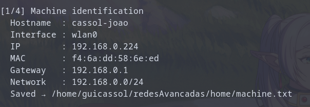

A descoberta foi realizada com o Nmap em duas etapas: varredura de hosts ativos (`nmap -sn`) e detecção de serviços, versões e sistema operacional (`nmap -sV -O --osscan-guess`). O tráfego foi capturado com `tcpdump` durante 35 minutos e analisado no Wireshark.

Para a geração e visualização de fluxos, a ferramenta nProbe exige licença comercial. Optou-se por uma cadeia equivalente de código aberto: o **softflowd** captura o tráfego da interface e exporta fluxos NetFlow v9; o **netflow2ng** atua como coletor, convertendo para o protocolo ZMQ; e o **ntopng** recebe e visualiza os fluxos. O ntopng confirmou o recebimento de 10.307 fluxos via ZMQ com 0% de descarte, validando o funcionamento do pipeline.

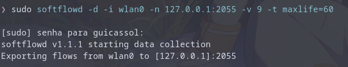

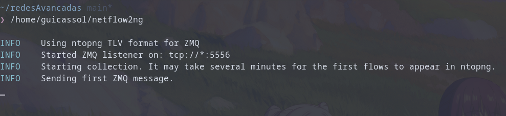

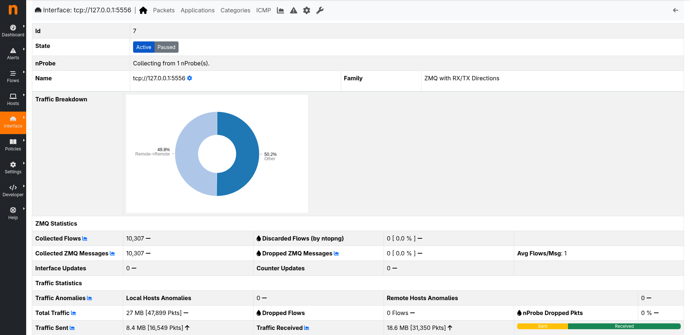

---

## 3. Ambiente Residencial

A rede residencial (192.168.0.0/24) apresentou **8 hosts ativos**. A Tabela 2 reúne os dispositivos com serviços ou sistema operacional identificáveis.

**Tabela 2 — Hosts e serviços no ambiente residencial**

| IP | Dispositivo | Portas e serviços | SO |
|---|---|---|---|
| 192.168.0.1 | Roteador ZTE (gateway) | 53 DNS, 80 HTTP, 443 HTTPS, 52869 UPnP | Linux 3.2–4.14 |
| 192.168.0.3 | Smart TV (Hon Hai / Sony Bravia) | 80 HTTP (nginx) | — |
| 192.168.0.28 | Smartphone Apple | 49152, 62078 | iOS 15 |
| 192.168.0.150 | PC (ASRock) | **3389 RDP** | Windows 10/11 |
| 192.168.0.224 | Máquina de coleta | 3000 (ntopng), 8080 | Linux 5.x–6.x |

Além desses, foram detectados um segundo dispositivo ZTE (192.168.0.2), um Samsung (192.168.0.6) e um adaptador AzureWave (192.168.0.23) sem portas relevantes abertas.

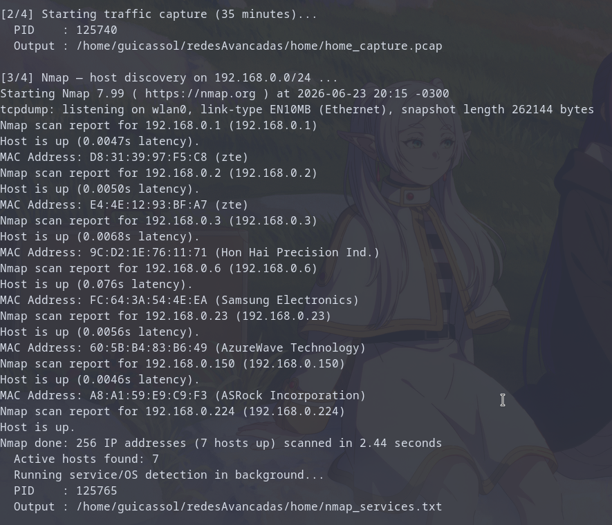

Durante os 35 minutos de monitoração, o ntopng registrou **~27 MB de tráfego** (47,9 mil pacotes) e 10.307 fluxos. Aproximadamente metade do tráfego foi classificada como Remote→Remote sobre **IPv6**, reflexo do uso intenso de serviços Google/QUIC. As aplicações predominantes foram TLS/HTTPS (incluindo TLS.Azure e TLS.GoogleCloud), com tráfego residual em HTTP e DNS. Os destinos externos concentraram-se em Google, Cloudflare, Microsoft Azure e Hetzner. Foi observado tráfego SSDP/UPnP multicast (239.255.255.250:1900) originado pelo host Windows, além da porta UPnP 52869 aberta no roteador.

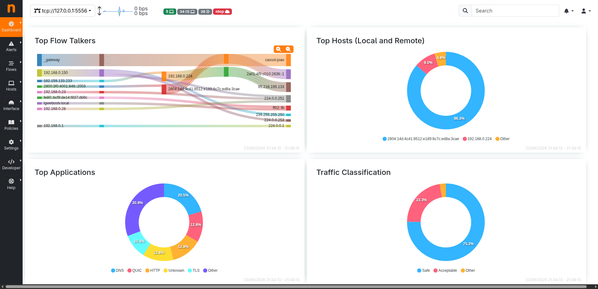

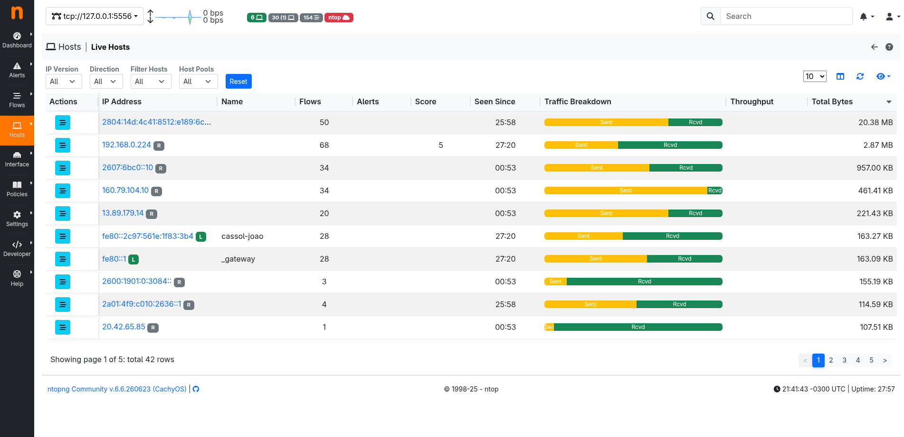

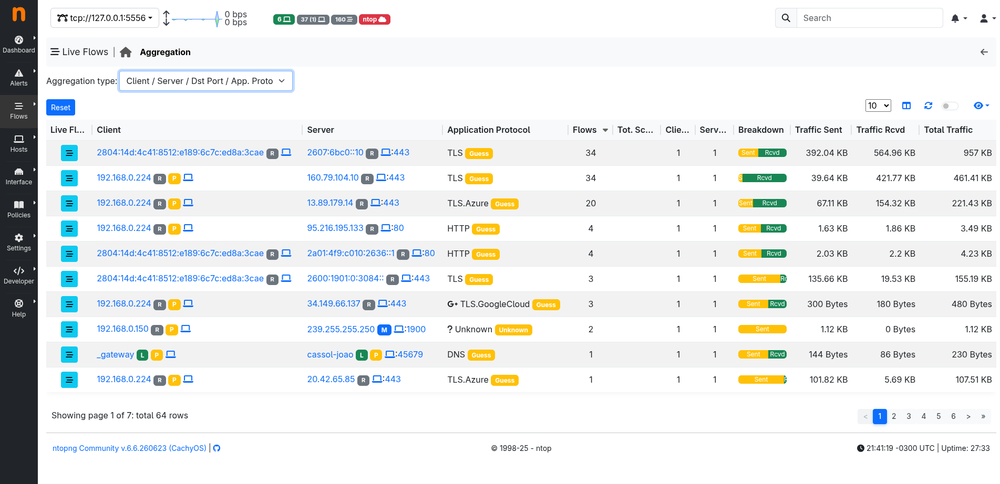

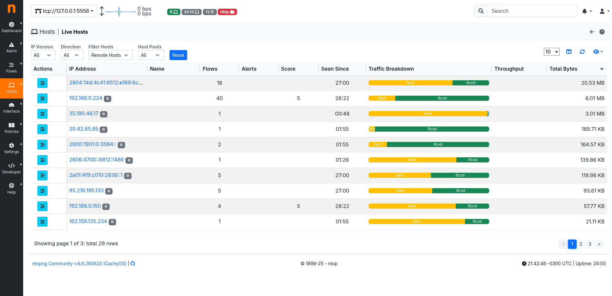

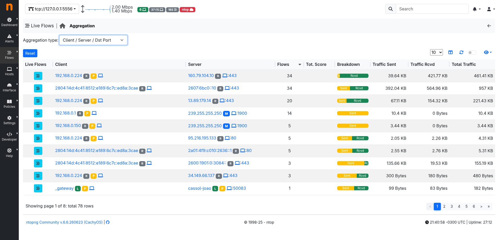

---

## 4. Ambiente Universitário

A rede universitária (10.132.240.0/20) revelou apenas **3 hosts ativos** dos 4.096 endereços escaneados, consequência direta do isolamento de clientes (*client isolation*) aplicado na rede sem fio, que impede a comunicação direta entre estações.

**Tabela 3 — Hosts e serviços no ambiente universitário**

| IP | Dispositivo | Portas e serviços | SO |
|---|---|---|---|
| 10.132.240.8 | Firewall Check Point (gateway) | 80 HTTP, 264 FW1-topology, 443 HTTPS | OpenBSD 7.0 (est.) |
| 10.132.240.10 | Controladora wireless Cisco | 22 SSH, 80, 443, 16113 | Cisco WLC |
| 10.132.242.95 | Máquina de coleta | — | Linux |

A monitoração mostrou maior taxa de transferência, com picos em torno de **17 Mbps**. As aplicações predominantes foram **TLS** (41 fluxos para 16 servidores distintos, ~2,5 MB), **TLS.Azure** (8 fluxos, 1,57 MB), **DNS** (10 fluxos) e **SSH** (1 fluxo, 468 MB — provável transferência de arquivos ou tunnel). Todo o tráfego DNS foi direcionado ao resolvedor interno `10.100.0.4:53`, característico de ambiente corporativo gerenciado. Os destinos externos incluíram Akamai, Microsoft, GitHub, Fastly, Google e Meta. O ntopng sinalizou score de risco elevado (100) em um fluxo na porta 8885.

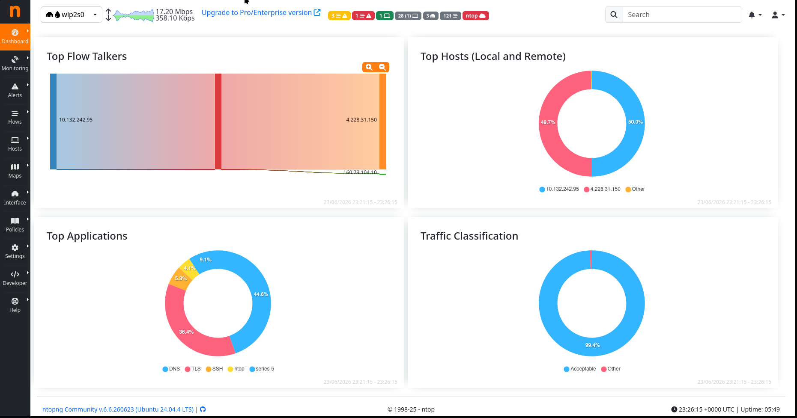

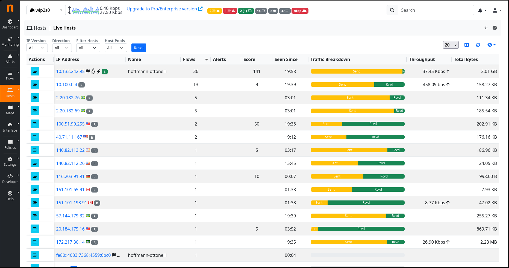

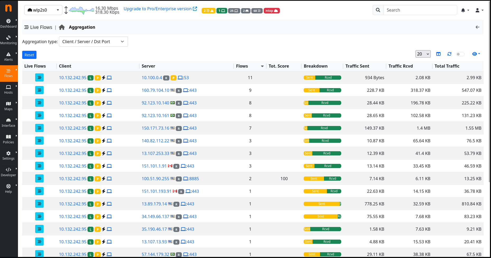

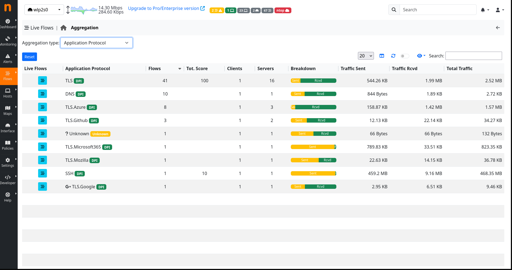

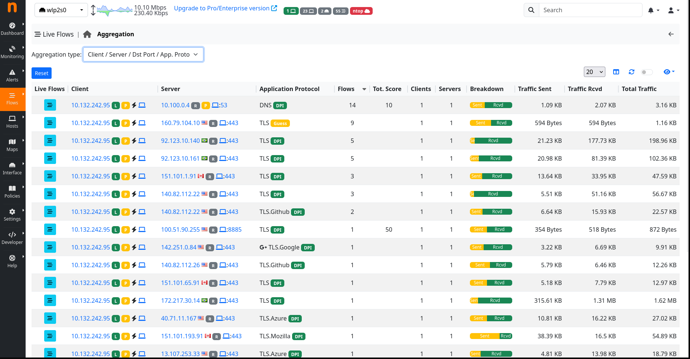

---

## 5. Análise Wireshark

### 5.1 ARP — rede residencial

O filtro `arp` revela o mecanismo de descoberta de camada 2. Os primeiros frames mostram o sweep ARP do Nmap: a máquina de coleta (`f4:6a:dd:58:6e:ed`) envia requisições broadcast "Who has 192.168.0.X?" para cada endereço da /24. O campo Target MAC é `00:00:00:00:00:00` (broadcast). As respostas (opcode 2) identificam gateway, TV, iPhone e demais dispositivos, revelando seus MACs antes de qualquer escaneamento TCP/UDP.

### 5.2 ICMP — rede residencial

O filtro `icmp` mostra o ping sweep do Nmap (Echo Request, tipo 8) para todos os hosts, seguido de Echo Reply (tipo 0) dos que responderam: 192.168.0.1, .3 (TV), .23 e .28 (iPhone). Hosts sem resposta aparecem como "No response found", indicando filtro ICMP ativo. O painel de detalhes exibe TTL, identificador e número de sequência de cada pacote.

### 5.3 DNS — rede residencial

O filtro `dns` exibe dois padrões distintos: (1) consultas A/AAAA para nomes externos — ex. `vscode-sync.trafficmanager.net` resolvido para `40.71.11.167` (Azure) — e (2) consultas PTR reversas (`.in-addr.arpa`) geradas pelo Nmap para tentar resolver os IPs descobertos. O servidor DNS é o roteador local (192.168.0.1). As consultas partem majoritariamente de endereço IPv6 link-local (`fe80::`), confirmando a predominância de IPv6 na rede doméstica.

### 5.4 DHCP — rede universitária

O filtro `dhcp` retorna apenas 2 frames, correspondentes à renovação de lease durante a captura. O Request (tipo 3) parte de `0.0.0.0` com hostname `hoffmann-ottonelli` no campo Option 12. O ACK (tipo 5) do servidor confirma IP `10.132.242.95`, máscara `/20`, gateway `10.132.240.8` e tempo de lease — evidenciando que a rede universitária utiliza DHCP com identificação de equipamento por hostname.

### 5.5 TLS — rede universitária

O filtro `tls.handshake.type == 1` isola os Client Hellos. O frame 104 mostra a máquina iniciando handshake TLS 1.3 com `104.16.1.34` (Cloudflare) para o domínio `registry.npmjs.org`, visível no campo SNI da extensão `server_name`. O painel de detalhes exibe as cipher suites ofertadas, versões suportadas (TLS 1.2 e 1.3) e demais extensões, demonstrando que toda comunicação sensível utiliza TLS com negociação moderna.

---

## 6. Análise Comparativa

**Tabela 4 — Comparação entre os ambientes**

| Critério | Residencial | Universitário |
|---|---|---|
| Endereçamento | 192.168.0.0/24 | 10.132.240.0/20 |
| Hosts ativos visíveis | 8 | 3 |
| Aplicação predominante | TLS/HTTPS + QUIC (IPv6) | TLS + SSH |
| Destinos externos | Google, Cloudflare, Azure, Hetzner | Akamai, Microsoft, GitHub, Fastly |
| Resolução DNS | Roteador local | Resolvedor interno (10.100.0.4) |
| Volume de tráfego | ~27 MB / 10.307 fluxos (35 min) | Picos de 17 Mbps |
| Descoberta de serviços | SSDP/UPnP visível | Não visível (isolamento) |
| Segurança | RDP e UPnP expostos na LAN | Firewall Check Point + isolamento de clientes |

A rede residencial é um domínio de broadcast único sem isolamento, permitindo enxergar dispositivos heterogêneos e seus mecanismos de descoberta (SSDP/UPnP). A rede universitária aplica isolamento de clientes e resolvedor DNS interno, reduzindo a visibilidade a equipamentos de infraestrutura e explicando a concentração em DNS. A maior diversidade de CDNs na universidade (Akamai, Fastly, GitHub) reflete o perfil acadêmico, enquanto a residência concentrou-se em serviços de consumo. A postura de segurança difere substancialmente: a residência expõe RDP (3389) e UPnP (52869) na LAN, enquanto a universidade protege o perímetro com firewall dedicado (Check Point NGX).

---

## 7. Comportamentos Inesperados

1. **Predomínio de IPv6 na residência:** aproximadamente metade do tráfego doméstico ocorreu sobre IPv6 (QUIC/Google), contrariando a expectativa de predomínio de IPv4 em redes domésticas.

2. **Serviços sensíveis expostos na LAN doméstica:** a presença de RDP (porta 3389) em um host Windows e de UPnP (porta 52869) no roteador representa uma superfície de ataque não esperada em uma rede residencial comum.

3. **Invisibilidade quase total na rede universitária:** o Nmap retornou apenas 3 hosts em 4.096 endereços — enquanto o ntopng registrou 23 hosts ativos com tráfego real. O isolamento de clientes da rede Wi-Fi universitária impede o ARP entre estações, tornando o Nmap ineficaz para descoberta horizontal.

4. **Fluxo SSH com 468 MB na universidade:** um único fluxo SSH acumulou volume muito superior ao esperado para sessões interativas, sugerindo uso como canal de transferência de dados ou tunnel, e ilustrando como um protocolo aparentemente benigno pode concentrar grande parte da largura de banda.

---

## 8. Conclusão

A combinação de Nmap, softflowd/netflow2ng/ntopng e Wireshark permitiu caracterizar dois ambientes de rede com comportamentos bastante distintos. A comparação evidenciou como decisões de projeto — segmentação, isolamento de clientes, resolvedor DNS interno e firewall de perímetro — afetam diretamente a visibilidade e o comportamento observável de uma rede. O trabalho também demonstrou que ferramentas de código aberto podem substituir soluções comerciais licenciadas sem prejuízo para a qualidade da análise.

---

## Referências

- LYON, G. *Nmap Network Scanning*. Disponível em: https://nmap.org/book/
- NTOP. *ntopng — Web-based Traffic Analysis*. Disponível em: https://www.ntop.org/
- SOFTFLOWD. *Flow-based network traffic analyser*. Disponível em: https://github.com/irino/softflowd
- NETFLOW2NG. *NetFlow v9 collector for ntopng*. Disponível em: https://github.com/synfinatic/netflow2ng
- WIRESHARK FOUNDATION. *Wireshark User's Guide*. Disponível em: https://www.wireshark.org/docs/
